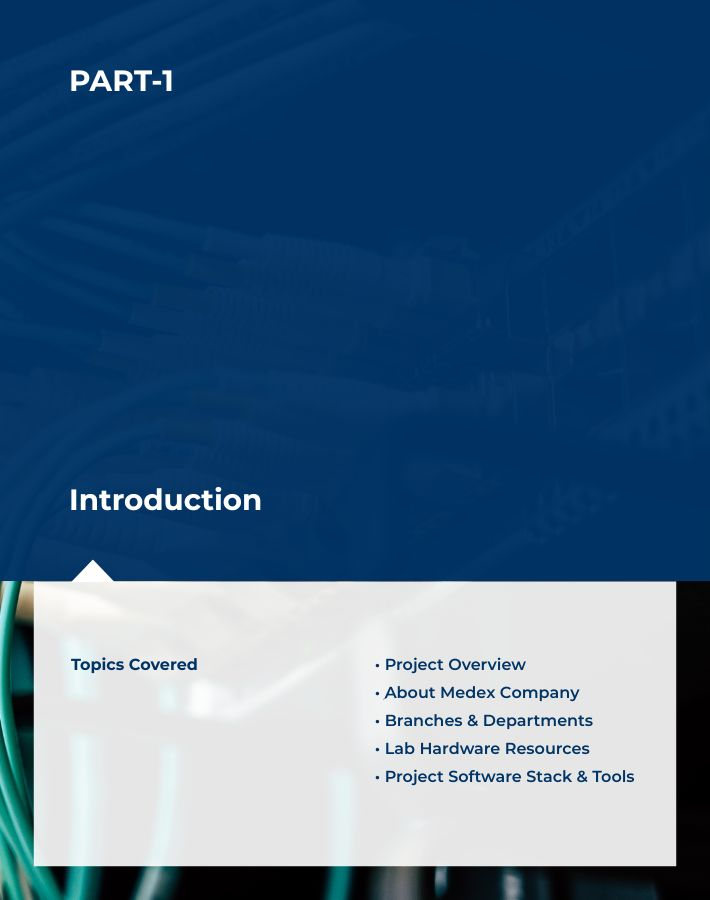
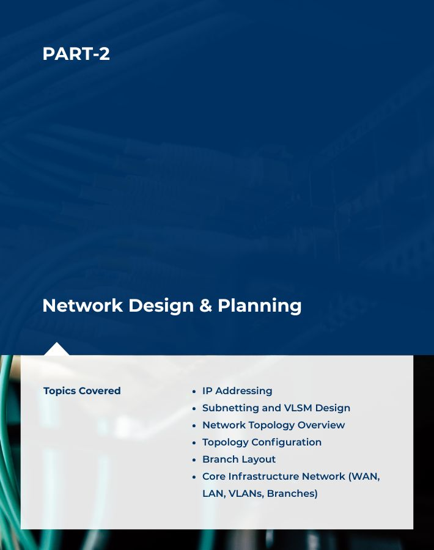
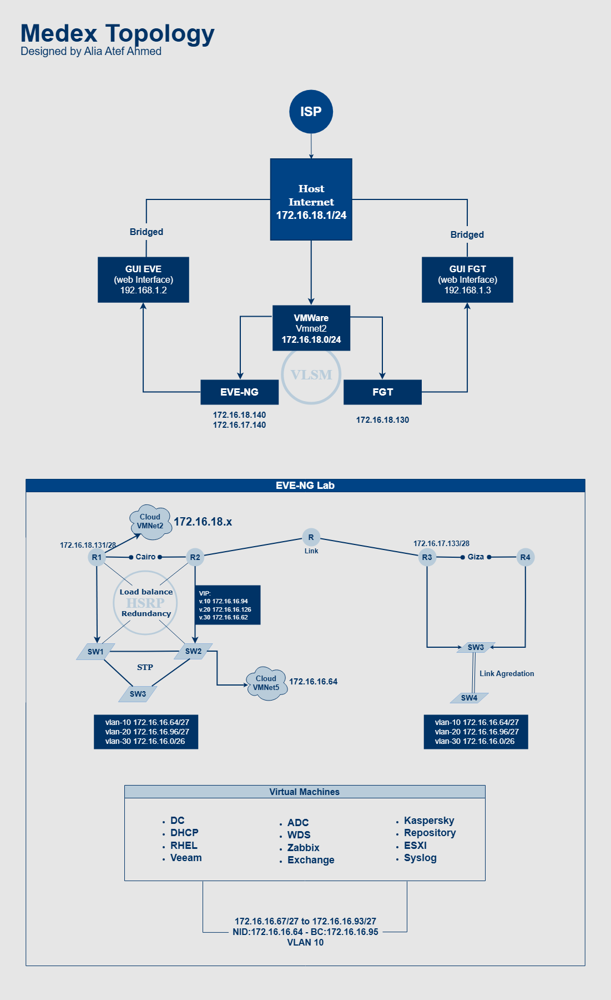

# Medex Enterprise Network &amp; System Documentation

Welcome to my Medex Enterprise Lab — a full network and system infrastructure simulation
designed to practice real-world enterprise scenarios in a structured, step-by-step way.

<details>
	
<summary> 	

# ➡️   :
</summary>

[Go to  Project Overview](https://github.com/Alia-lilo/Medex/blob/main/README.md#-project-overview)

[Go to  What is Medex?](https://github.com/Alia-lilo/Medex/blob/main/README.md#--what-is-medex)

[Go to  Lab Hardware Resources](https://github.com/Alia-lilo/Medex/blob/main/README.md#-lab-hardware-resources)

[Go to  Project Software Stack & Tools](https://github.com/Alia-lilo/Medex/blob/main/README.md#%E2%80%8D-project-software-stack--tools)

[Download Resources](https://github.com/Alia-lilo/Medex/blob/main/README.md#you-can-download-from-here)

[Go to  IP Addressing & VLSM Design](https://github.com/Alia-lilo/Medex/blob/main/README.md#ip-addressing--vlsm-design)

[Go to  Network Topology Overview](https://github.com/Alia-lilo/Medex/blob/main/README.md#%EF%B8%8Fnetwork-topology-overview)

[Go to  Lab Infrastructure](https://github.com/Alia-lilo/Medex/blob/main/README.md#-lab-infrastructure-wan-lan-vlans-branches)

[Go to  Virtualization Setup](https://github.com/Alia-lilo/Medex/blob/main/README.md#virtualization-setup)
	
🗃️ Other Documentation

[Go to  Full Lab Deployment in EVE-NG](EVE_Full_Lab_Deployment):

- [Go to  do this Before configuration](EVE_Full_Lab_Deployment/Before-configuration.md)
	
- [Go to  Cairo Routers Configuration](EVE_Full_Lab_Deployment/Cairo_Routers.md)
	
- [Go to  Cairo Switches Configuration](EVE_Full_Lab_Deployment/Cairo_Switches.md)
	
- [Go to  Giza Routers Configuration](EVE_Full_Lab_Deployment/Giza_Routers.md)
	
- [Go to  Giza Switches Configuration](EVE_Full_Lab_Deployment/Giza_Switches.md)
	
- [Go to  How to Connect Cairo and Giza](EVE_Full_Lab_Deployment/Linking-Cairo-Giza.md)

 [GO to  Prepare the Network Environment](docs/2__Prepare_the_Network_Environment.md)

 [GO to  Solve Switches-License Problem](docs/Switches-License-Issue-Eve.md)

[Go to  FGT Configuration](docs/FGT_Configuration.md)

 [Go to Domain Controller Setup](VMs/DC_Setup.md)  

  [Go to Additional Domain Controller Deployment](VMs/Additional_DC_Deployment.md)  

  [Go to DHCP Deployment](VMs/DHCP_Setup.md)  

 [Go to WDS Deployment](VMs/WDS_Setup.md)  

 [Go to GPO Configuration (All Policies)](VMs/GPO_Configuration_All.md)  

`This includes all GPOs applied across the environment — they are not covered in the DC documentation.`

 [Go to Kaspersky Deployment](VMs/Kaspersky_Setup.md)  

 [Go to Syslog Server Setup](VMs/Syslog_Setup.md)  

 [Go to Zabbix Deployment](VMs/Zabbix_Setup.md)  

 [Go to RHEL Deployment](VMs/RHEL_Setup.md)  

 [Go to Exchange Deployment](VMs/Exchange_Setup.md)  

 [Go to Veeam Backup Configuration](VMs/Backup_Veeam.md)



</details>

## 📖 Project Overview

This is a training project I created for myself to apply everything I’ve learned so far in both networking and system administration. I wish I could build a larger, more complex environment, but I was limited by my laptop’s performance, so I divided the project into two interconnected parts: network infrastructure and server services. 


💻 On the networking side, I implemented and tested core concepts and protocols.

💻 On the system side, I configured a wide range of Windows Server services.

The project scenario is built to simulate a realistic enterprise environment, with my laptop acting as the internet source (similar to an ISP router). Inside the laptop, I built a full lab in EVE-NG, including routers, switches, and servers. A FortiGate firewall serves as the core gateway for the lab. It connects:

LAN → for the internal network (Switches, Servers).

WAN → to access the internet through the laptop.

All lab devices use FortiGate as their default gateway, and FortiGate uses the laptop’s virtual adapter as its own internet gateway.
 ```   
    However, I encountered a challenge, which is licensing limitation: the FortiGate .qcow2 image in
    EVE-NG offers only a 15-day trial license. This was impractical for me, as I work on the project 
    part-time after my full-time job. Also, I’m learning and building everything
    step-by-step, not just deploying a ready-made template.
```
To overcome this, I deployed the FortiGate.ova version as a separate VM on VMware Workstation, allowing me to work without license restrictions. This version, however, supports only three interfaces and three static routes, which limited certain advanced configurations I originally planned.

To integrate both environments, I connected the FortiGate VM with EVE-NG via **VMware's vmnet2** virtual network. As a result, **FortiGate is like a secure bridge between the virtual lab (Eve) and the internet** through my laptop, completing the hybrid setup.

## 🏢  **What is Medex?**

Medex is a small enterprise that imports medical devices and supplies from international vendors and distributes them to hospitals and clinics. The company has two physical branches:
the **Head Office** in Cairo and the **Branch Office** in Giza.

The company operates with the following:

IT Department | Finance | Sales & Marketing | Logistics & Warehouse | Human Resources (HR)

| Executive Management | Customer Support | Shared printers | Access Points

## 💻 **Lab Hardware Resources**

My Personal laptop:

- Storage: 1TB
- RAM: 32GB DDR5
- Processor: 13th Gen Intel(R) Core (TM) i7-13620H, 2400 Mhz, 10 Core(s), 16 Logical Processor(s)
- GPU: NVIDIA GeForce RTX 4060 Laptop GPU

**Internet Connection:** Wifi

## 👩🏻‍💻 **Project Software Stack & Tools**

- **EVE-NG**
- **VMware Workstation** (or **ESXi** if enough resources are available)
- **Router image:** `c3725-adventerprisek9-mz.124-15.T14`

> This IOS image was selected because it provides the required routing features for our lab while keeping resource usage low, which is ideal for running multiple routers on my personal laptop.)
**- If you have more hardware resources available, there’s an advanced image that includes additional features: `c7200-advipservicesk9-mz.152-4.S5`
> 
- **Switch image:** ` i86bi-linux-l2-adventerprisek9-15.2d` (best choice for our resources)
  advanced image: ` i86bi_LinuxL3-AdvEnterpriseK9-M2_157  `
- **Windows Server 2019 ISO**
- **Windows 10 Pro ISO**
- **FortiGate OVA**
- **WinSCP** or **FileZilla** *(WinSCP is preferred)*
- **PuTTY**

### You can download from here:

You can download all the required files and tools from the following links:

[Download FGT_VM64-v7.4.8.ovf](https://drive.google.com/drive/folders/1cQd2S4FOJfUI407sDLKHFHZ41SY6GS-1?usp=drive_link)

[Download zabbix_appliance-7.0.6-ovf](https://drive.google.com/drive/folders/1rJO0zkG8uHTDuakQraICXuTmyboIvnjH?usp=drive_link)

`We will install Zabbix on Linux later, but in case you prefer using Zabbix as a VM, you can use this appliance`

[Download EVE](https://drive.google.com/drive/folders/1TLgmhgWTuhsd0Xy3xEX88L5L-bY-kvUp?usp=drive_link)

[Download VMware-VMvisor-Installer-7.0U2.iso](https://drive.google.com/file/d/1qw9AMuI9o0r1RhWMXBqFV0wBaXnRJtwb/view?usp=drive_link)

[Download Windows 10 Pro 20H2 Multi Preactivated Jan 2021 x64.iso](https://drive.google.com/file/d/1UMWfJUAyrd7Ap5P9_hWWXPZe2oAF_7hf/view?usp=drive_link)

[Download RHEL_9.4](https://drive.google.com/file/d/1gSoUhSN_Eb2AuP14OyBSlxMRE0rAXz1y/view?usp=drive_link)

[Download kaspersky4win.exe](https://drive.google.com/file/d/1IZ0XKFg6oa55VWPqYa24lDGvZMY8Xp0P/view?usp=drive_link)

[Download SERV2019.ENU.JUN2020.ISO](https://drive.google.com/file/d/1VWeJApTnBacycl3UO2-RTlGlExz6-53z/view?usp=drive_link)

-----------
# 🔷 2. Network Design & Planning


## 🔹IP Addressing & VLSM Design
Everything is documented in detail because I want it to be perfect.

After finishing the entire plan, I often realize that I need a larger subnet here or a different range there — and I end up redoing the whole addressing scheme from scratch. And that’s totally fine.

**Here’s my advice for anyone building their own VLSM design:**

Do it manually first. Don’t rely on online calculators right away.
When you train your mind and eyes to calculate subnets yourself, you’ll quickly start spotting typos or incorrect values — and, more importantly, you’ll understand why each subnet was assigned the way it was.

Later, you can double-check your work using tools, but your foundation will be much stronger.

**Variable Length Subnet Masking (VLSM)** was applied to the networks  `172.16.16.0/24, 172.16.17.0/24`

The addressing strategy was designed based on each department’s size, number of devices, and purpose, with careful planning to minimize IP waste and allow for future scalability.
Later, you can double-check your work using tools, but your foundation will be much stronger.

Note: `My real-world experience with company organizational structures is still limited, but this project was a great opportunity to practice practical design logic.`

## shit
| ✅ Lab Core Network IP Plan |
|:-----|

|       Network ID | Usable Hosts | Broadcast | Subnet Mask | CIDR |
|:-----|-------|-------|-----|---------------|
| 172.16.18.0 | 172.16.18.1-254 | 172.16.18.255 | 255.255.255.0 | `/24` |

|||
|:-----|--|
| Host       | 172.16.18.1/24 |
| EVE | 172.16.18.140/24 |
| FGT | 172.16.18.130/24 |
| R1 to cloud| 172.16.18.131/24 |


| ✅ Medex_Infrastructure_Network |
|:-----|

| zone | Hosts | |Network ID | Usable Hosts | Broadcast | Subnet Mask | CIDR
|:-----|-------|-------|-----|---------------|-----|---------------|-----|
| Extra | 8 | 172.16.16.128 |172.16.16.129 – 142|172.16.16.143|`/28`|255.255.255.240|
|Cairo<br>Head Office | 30 (IT)<br>20 (mng)<br>40 (emp)<br>(2 host) | vlan-10<br>vlan-20<br>vlan-30<br>P2P | 172.16.16.64<br>172.16.16.96<br>172.16.16.0<br>172.16.16.144<br>..<br>.. | 172.16.16.65 – 94<br>172.16.16.97 - 126<br>172.16.16.1 - 62<br>145-146,153-154<br>161-162,<br>… | 172.16.16.95<br>172.16.16.127<br>172.16.16.63<br>..<br>..| 255.255.255.224<br>255.255.255.224<br>255.255.255.192<br>255.255.255.252 | `/27`<br>`/27`<br>`/26`<br>`/30`<br>`/30`<br>`/30`
| Extra_Giza | 8 | 172.16.17.128 |172.16.17.129 – 142|172.16.17.143|`/28`|255.255.255.240|
|Giza<br>Branch Office | 30 (IT)<br>30 (mng)<br>60 (emp)<br>(2 host) | vlan-10<br>vlan-20<br>vlan-30<br>P2P | 172.16.17.64<br>172.16.17.96<br>172.16.17.0<br>172.16.17.144<br>..<br>..| 172.16.16.65 – 94<br>172.16.16.97 - 126<br>172.16.16.1 - 62 | 172.16.16.95<br>172.16.16.127<br>172.16.16.63 | 255.255.255.224<br>255.255.255.224<br>255.255.255.192<br>255.255.255.252 |`/27`<br>`/27`<br>`/26`<br>`/30`|
 ##  ⚒️Network Topology Overview



<details >
<summary> Network Technologies:</summary>

- VLANs   
- Rapid PVST+   
- OSPF   
- HSRP   
- Manual Load Balancing   
- Link Aggregation   
- FortiGate Firewall   
- ADC  
</details>

<details >
<summary>Systems & Services:</summary>
 
- Domain Services (AD DS)  
- DHCP   
- WDS   
- Exchange Server   
- Kaspersky  
- RHEL   
- Zabbix   
- Syslog
and more
</details>

## 🔹 Lab Network Infrastructure Overview

We'll install FortiGate and EVE-NG as VMs on VMware Workstation.

I’ll briefly explain the plan, then we’ll continue together, step by step, following the network diagram.

- We will use **three network adapters** in VMware:

  1. `bridged` — for Internet access.  
  2. `VMnet2` — the core network that links the project: EVE-NG, FortiGate, and the host.  
  3. `VMnet5` — dedicated to the lab inside EVE-NG.
   
- **FortiGate VM** — three network adapters:
  1. `bridged` — connect to the host for Internet access.  
  2. `VMnet2` — connect to the core network.  
  3. `VMnet5` — connect to the lab.

- **EVE-NG VM** — three network adapters:
  1. `bridged` — connect to the Internet (for updates/tools).  
  2. `VMnet2` — connect to the core network.  
  3. `VMnet5` — connect to the lab.

Inside EVE-NG:  
We'll create **two cloud networks** (`VMnet2` and `VMnet5`) to ensure full connectivity between the EVE lab, the FGT VM, and the host.  

📄 We'll go ahead according to the network diagram, following the next steps..  ⬇️
 
 [Prepare the Network Environment](docs/Prepare_the_Network_Environment.md)  
 

### To be continued in the additional documentation for more details...

Check this : [TOC](/Table_of_Contents.md)  
